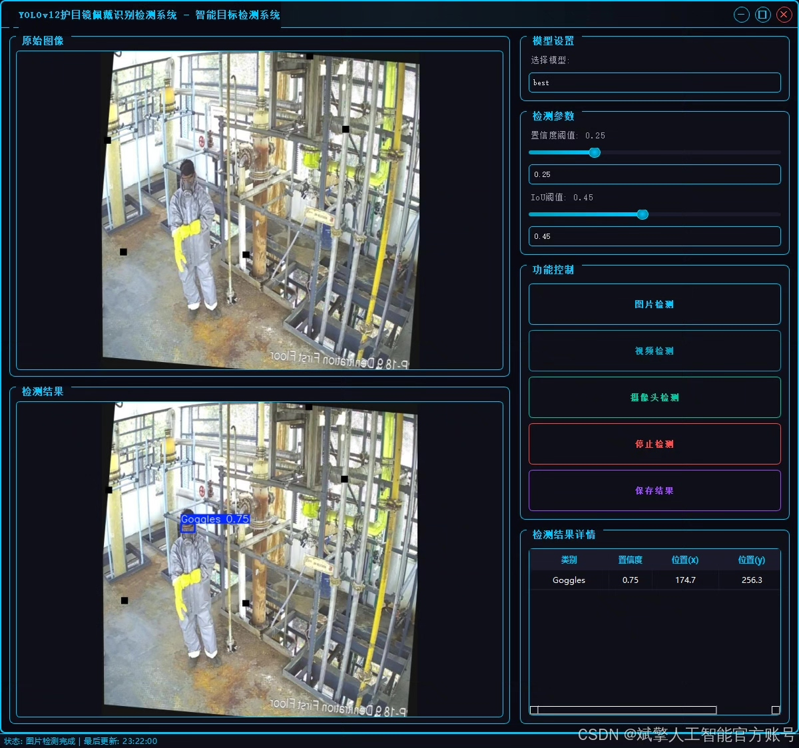
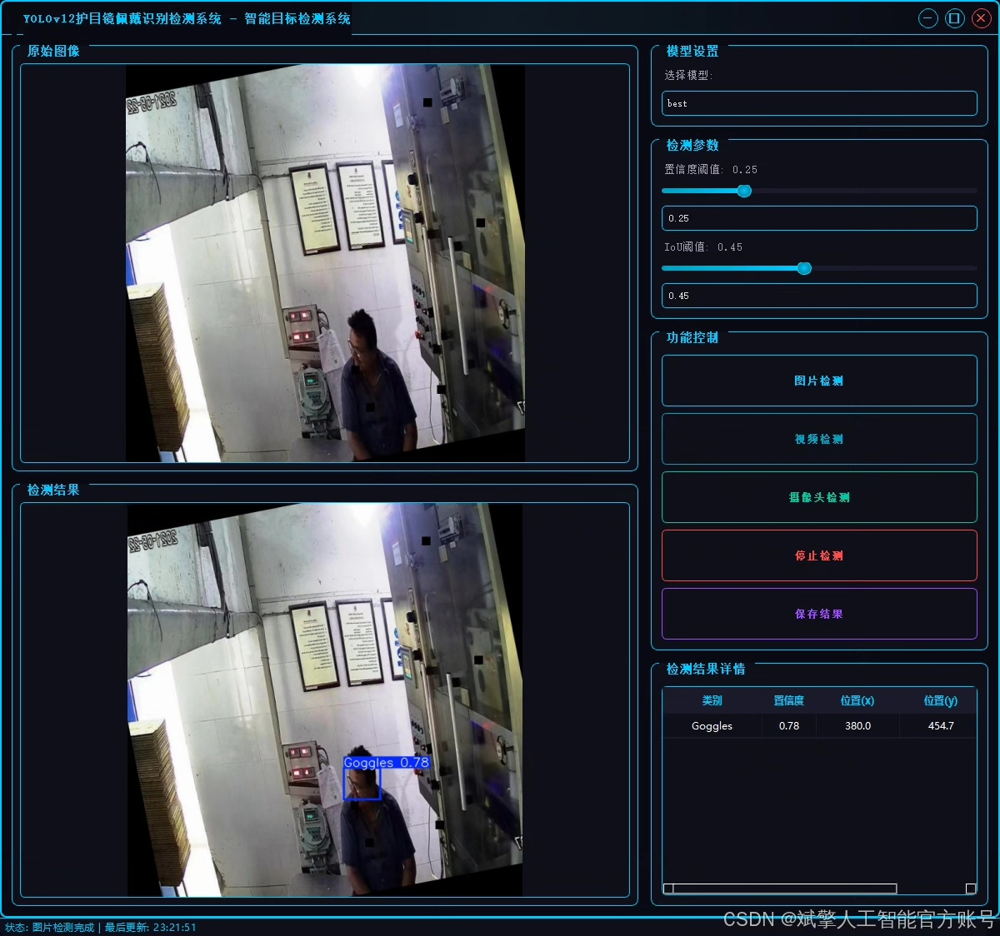
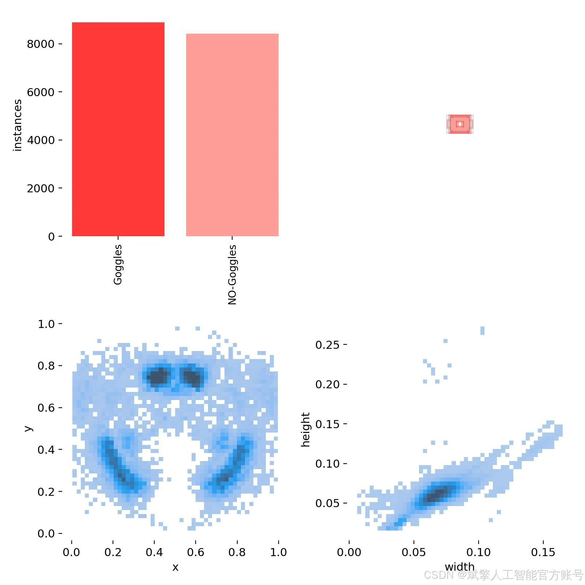
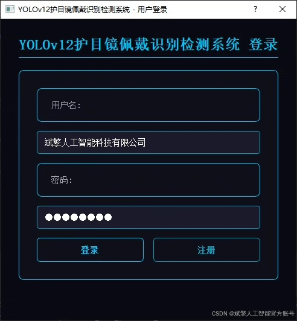
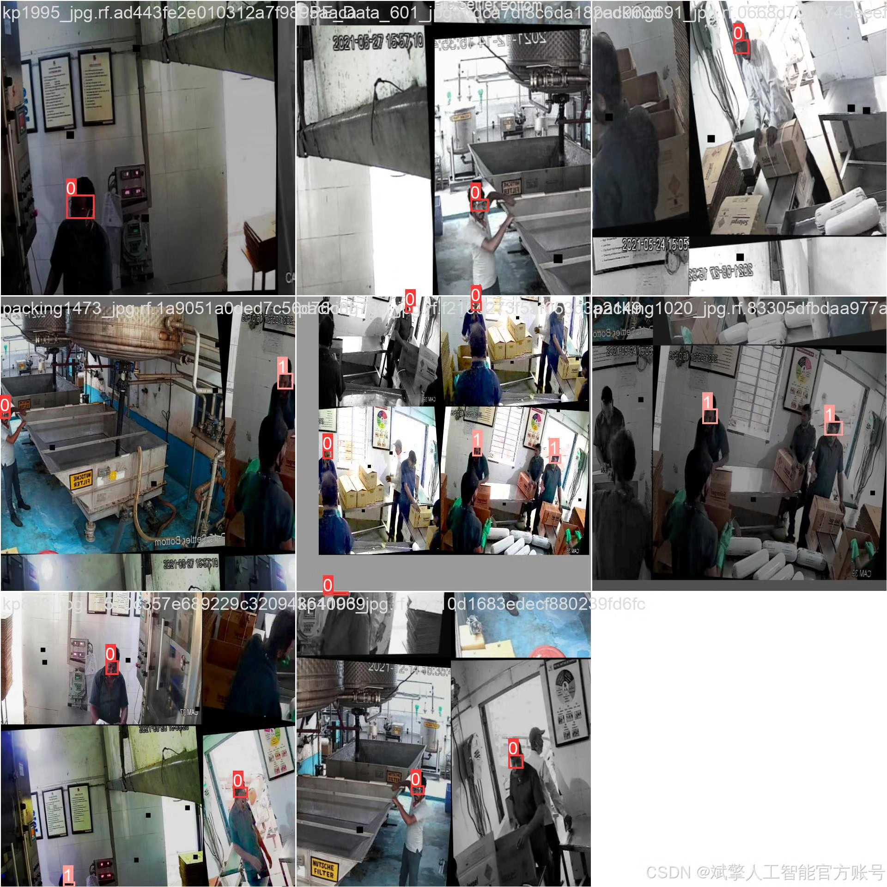
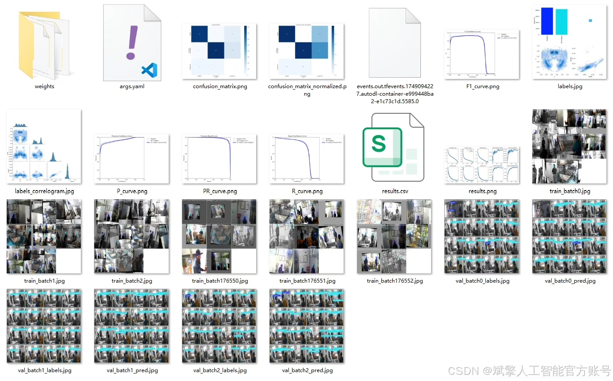
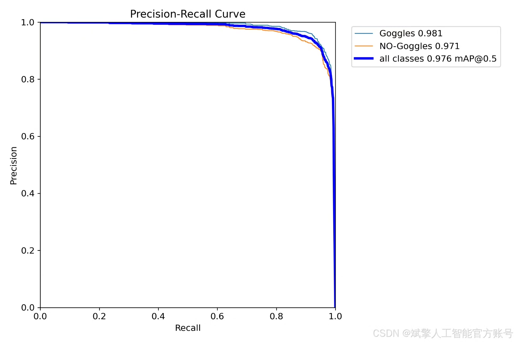
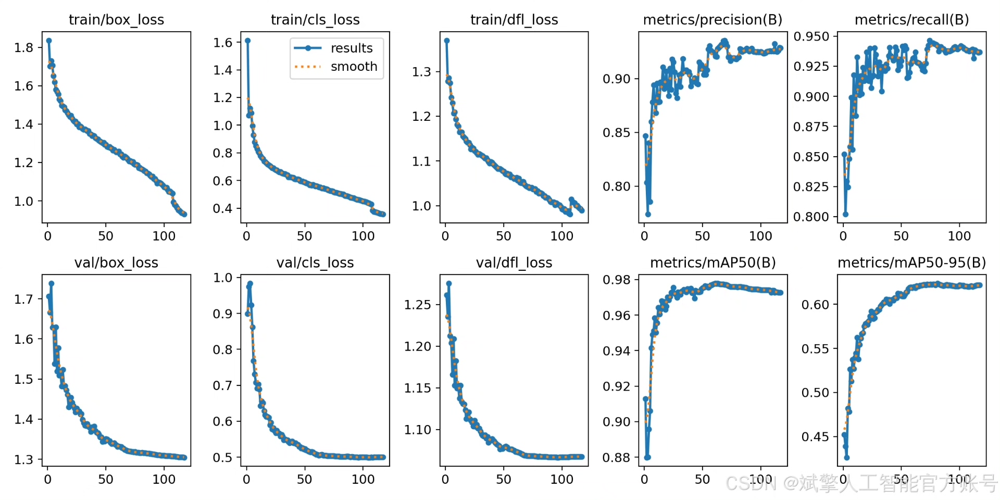
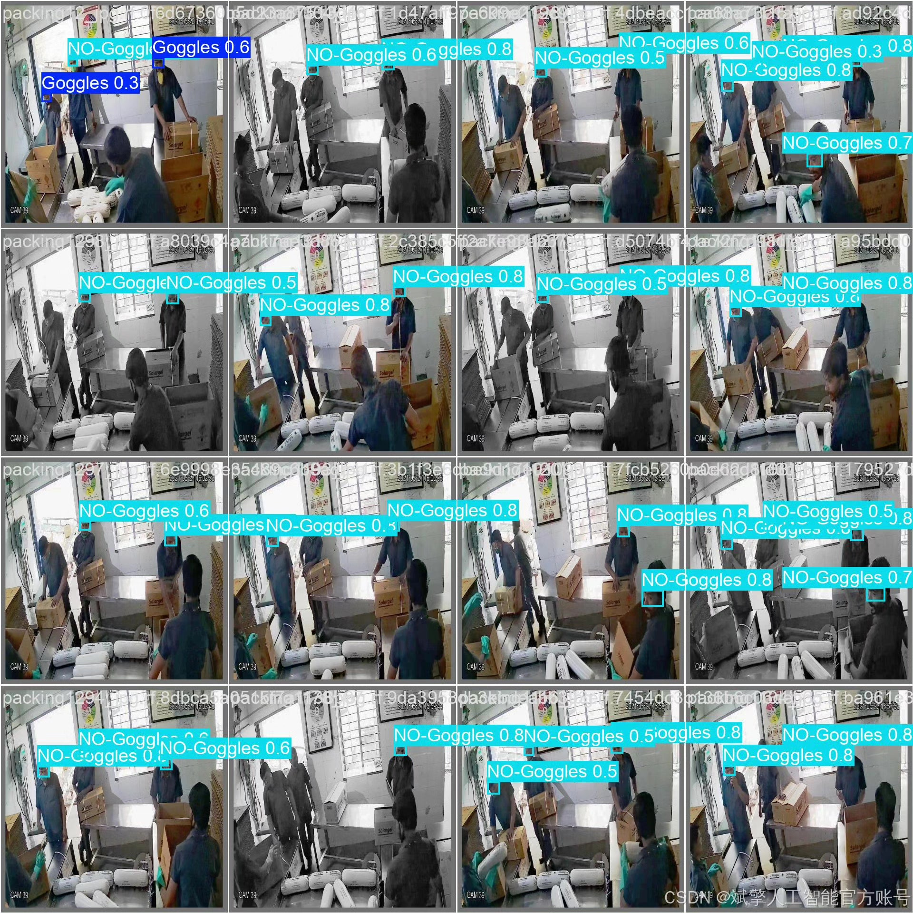

# YOLOv12 goggles recognition software resources

## Body

YOLOv12 Goggles Recognition Software Resources Based on Deep Learning YOLOv12: A Goggles Wearing Recognition and Detection System (YOLOv12+YOLO dataset + UI interface + login registration interface + Python project source code + model)

This paper designs and implements a deep learning-based Goggles wearing recognition and detection system. The goal is to automatically detect whether workers are properly wearing goggles through computer vision technology, thereby enhancing the level of intelligent safety management. The system employs an improved YOLOv12 object detection algorithm, combined with a custom dataset containing 15,083 images (13,200 training images, 1,256 validation images, and 627 test images). It achieves high-precision detection for "wearing goggles" (Goggles) and "not wearing goggles" (NO-Goggles) targets. Additionally, the system integrates a user-friendly UI interface, supporting login registration functions. Experiments show that the system achieves an mAP of 97.6% on the test set, demonstrating real-time performance (45 FPS) and robustness, making it widely applicable in high-risk environments such as factories and laboratories for safety supervision.

✅ User Login and Registration: Supports password verification and security validation.
✅ Three detection modes: Based on the YOLOv12 model, supports image, video, and real-time camera detection, accurately recognizing targets.
✅ Dual-screen comparison: Displays original images and detection results on the same screen.
✅ Data visualization: Real-time table displaying the category, confidence, and coordinates of detected targets.
✅ Intelligent parameter adjustment: Offers a confidence slide bar to dynamically optimize detection accuracy, adapting to different scene requirements.
✅ Sci-fi style interactive interface: Dark theme paired with dynamic light effects, reducing visual fatigue and improving operational experience.

## Images

## Payment

Here is a pay link on Stripe ( https://buy.stripe.com/3cs8yP7sY87d0vu9AB ). Please contact me lonlonago@foxmail.com after funding $89, and I will send you a complete data files , thank you!

